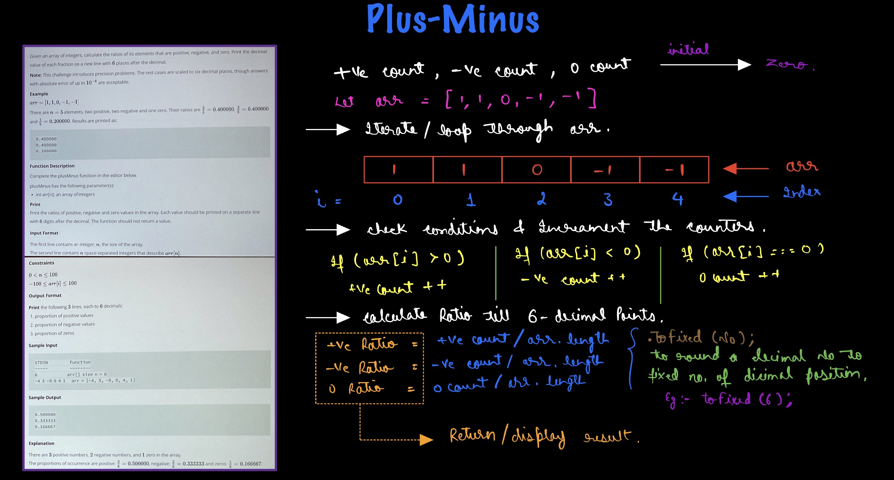

# Hacker Rank - Plus-Minus

**Problem Statement** - https://www.hackerrank.com/challenges/three-month-preparation-kit-plus-minus/problem?isFullScreen=true&h_l=interview&playlist_slugs%5B%5D=preparation-kits&playlist_slugs%5B%5D=three-month-preparation-kit&playlist_slugs%5B%5D=three-month-week-one

## Explaination - 


## Solution 1 - (Tradetional Approach) -

```js
function plusMinus(arr) {
    // Write your code here
    let posCount = 0;
    let negCount = 0;
    let zeroCount = 0;
    for (let i = 0; i < arr.length; i++) {
        if (arr[i] > 0) {
            posCount++;
        } else if (arr[i] < 0) {
            negCount++;
        } else {
            zeroCount++;
        }
    }
    let pos = (posCount/arr.length).toFixed(6);
    let neg = (negCount/arr.length).toFixed(6);
    let zero = (zeroCount/arr.length).toFixed(6);
    
    console.log(pos);
    console.log(neg);
    console.log(zero);
}
```

## Solution 2 - (Using filter()) -

```js
function plusMinus(arr) {
    // Write your code here
    let pos = (arr.filter(num => num > 0).length / arr.length).toFixed(6);
    let neg = (arr.filter(num => num < 0).length / arr.length).toFixed(6);
    let zero = (arr.filter(num => num === 0).length / arr.length).toFixed(6);
    
    console.log(pos);
    console.log(neg);
    console.log(zero);
}
```