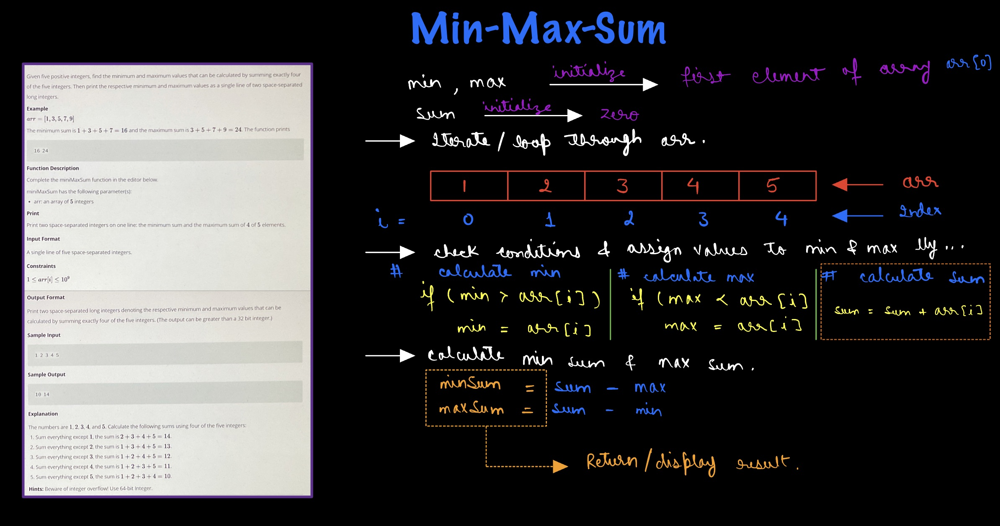

# Hacker Rank - Min-Max-Sum

**Problem Statement** - https://www.hackerrank.com/challenges/three-month-preparation-kit-mini-max-sum/problem?isFullScreen=true&h_l=interview&playlist_slugs%5B%5D=preparation-kits&playlist_slugs%5B%5D=three-month-preparation-kit&playlist_slugs%5B%5D=three-month-week-one

## Explaination - 


## Solution -
```js
function miniMaxSum(arr) {
    // Write your code here
    
    let max = arr[0];
    let min = arr[0];
    let sum = 0;
    
    for (let i = 0; i < arr.length; i++) {
        if (max < arr[i]) {
            max = arr[i];
        }
        if (min > arr[i]) {
            min = arr[i];
        }
        sum += arr[i];
    }
    
    let maxSum = sum - min;
    let minSum = sum - max;
    
    console.log(minSum + " " + maxSum);

}
```