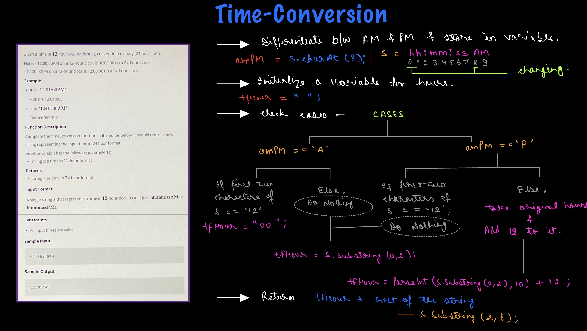

# Hacker Rank - Time Conversion

**Problem Statement** - https://www.hackerrank.com/challenges/three-month-preparation-kit-time-conversion/problem?isFullScreen=true&h_l=interview&playlist_slugs%5B%5D=preparation-kits&playlist_slugs%5B%5D=three-month-preparation-kit&playlist_slugs%5B%5D=three-month-week-one

## Explaination - 


## Solution -
```js
function timeConversion(s) {
    // Write your code here
    
    // format of s ----> hh:mm:ssPM OR hh:mm:ssAM
    // NOTE: only hours are changing 
    
    //--------CASES------
    // CASE-1) 12 AM ---> 00
    // CASE-2) 1 AM to 11 AM ----> do nothing
    // CASE-3) 1 PM to 11 PM ----> take hour, add 12
    
    let amPM  = s.charAt(8); // amPM = 'A' OR 'P'
    let tfHour = "";
    if (amPM == "A") {
        if (s.substring(0,2) == "12") {
            tfHour = "00";
        }
        else {
            tfHour = s.substring(0,2);
        }
    }
    else {
        if (s.substring(0,2) == "12") {
            tfHour = s.substring(0,2);
        }
        else {
            tfHour = parseInt(s.substring(0,2), 10) + 12;
        }
    }
    
    return tfHour + s.substring(2,8);

}
```