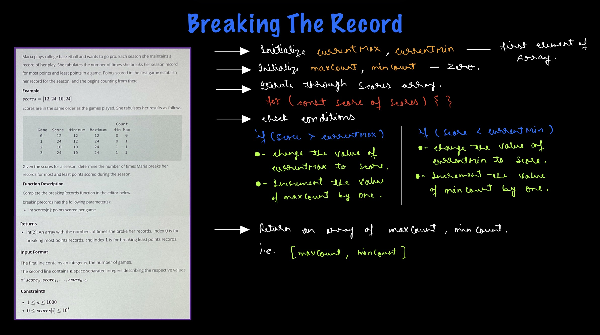

# Hacker Rank - Breaking the Records

**Problem Statement** - https://www.hackerrank.com/challenges/three-month-preparation-kit-breaking-best-and-worst-records/problem?isFullScreen=true&h_l=interview&playlist_slugs%5B%5D=preparation-kits&playlist_slugs%5B%5D=three-month-preparation-kit&playlist_slugs%5B%5D=three-month-week-one

## Explaination - 


## Solution -
```js
function breakingRecords(scores) {
    // Write your code here
    let currentMin = scores[0];
    let currentMax = scores[0];
    let minCount = 0;
    let maxCount = 0;
    
    for(const score of scores) {
        if (score > currentMax) {
            currentMax = score;
            maxCount++;
        }else if (score < currentMin) {
            currentMin = score;
            minCount++;
        }
    }
    return [maxCount, minCount];

}
```