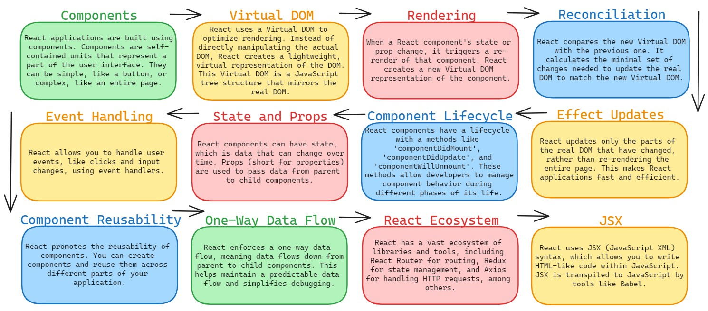

# Real DOM VS Virtual DOM

## Working of React -

## Real DOM (Document Object Model) -
- The Real DOM is the actual, physical representation of a web page's structure in memory.
- It consists of a tree of objects, each representing an element (like div, p, etc.) and its properties (attributes, text content, etc.).
- When there's a change in the web page, the entire Real DOM is updated and re-rendered.
- Updating the Real DOM can be slow and inefficient, especially for complex web applications.

## Virtual DOM (Document Object Model) -
- The Virtual DOM is a lightweight, virtual representation of the Real DOM.
- It is a JavaScript data structure that mirrors the structure of the Real DOM but contains no actual HTML elements.
- When a change occurs in a web application, the change is first reflected in the Virtual DOM.
- Then, the Virtual DOM is compared to the previous version to identify the minimal set of changes needed to update the Real DOM.
- This process is known as **Reconciliation**, and is much faster than directly manipulating the Real DOM.

